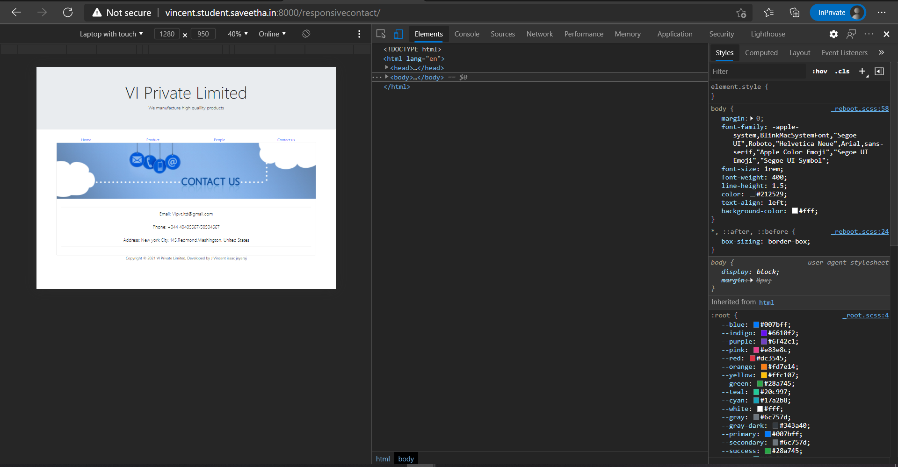
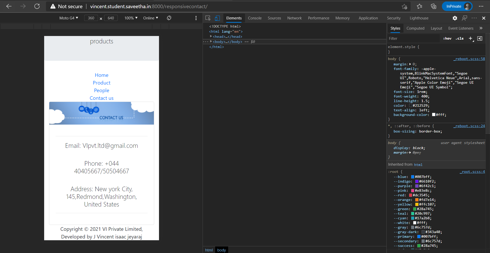
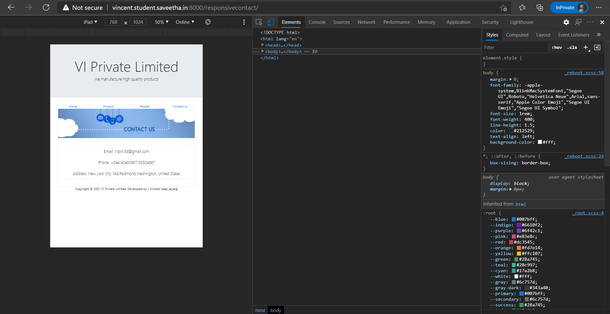

# Design of Responsive Website
## AIM:
To design a responsive website with two break points.

## DESIGN STEPS:
### Step 1: 
Requirement collection.
### Step 2:
Creating the layout using HTML and CSS.
### Step 3:
Updating the sample content.
### Step 4:
Choose the appropriate style and color scheme.
### Step 5:
Validate the layout in various browsers.
### Step 6:
Validate the HTML code.
### Step 7:
Create a database model and migrate the database.
### Step 8:
Retrieve data from database and display it in a dynamic webpage.
### Step 9:
Publish the website in the given URL.

## PROGRAM:

### base.html
```

<!doctype html>
<html lang="en">
  <head>
    <!-- Required meta tags -->
    <meta charset="utf-8">
    <meta name="viewport" content="width=device-width, initial-scale=1, shrink-to-fit=no">

    <!-- Bootstrap CSS -->
    <link rel="stylesheet" href="https://maxcdn.bootstrapcdn.com/bootstrap/4.0.0/css/bootstrap.min.css" integrity="sha384-Gn5384xqQ1aoWXA+058RXPxPg6fy4IWvTNh0E263XmFcJlSAwiGgFAW/dAiS6JXm" crossorigin="anonymous">

    <title>VI Limited</title>
  </head>
  <body>
    <div class="jumbotron">
        <div class="container text-center">
            <h1 class="display-3">VI Private Limited</h1>
            <p class="lead">We manufacture high qualilty products</p>
        </div>
    </div>
    <div class="container">
        <div class="row text-center">
            <div class="col-12 col-md-3"><a href="/responsivehome">Home</a></div>
            <div class="col-12 col-md-3"><a href="/responsiveproduct">Product</a></div>
            <div class="col-12 col-md-3"><a href="/responsivepeople">People</a></div>
            <div class="col-12 col-md-3"><a href="/responsivecontact">Contact us</a></div>
        </div>
    </div>
    <div class="container">
        
    
    </div>
    <div class="container">
        <div class="row align-items-end">
            <div class="col text-center">
                Copyright © 2021 VI Private Limited, Developed by J Vincent isaac jeyaraj
            </div>
        </div>
    </div>
    <!-- Optional JavaScript -->
    <!-- jQuery first, then Popper.js, then Bootstrap JS -->
    <script src="https://code.jquery.com/jquery-3.2.1.slim.min.js" integrity="sha384-KJ3o2DKtIkvYIK3UENzmM7KCkRr/rE9/Qpg6aAZGJwFDMVNA/GpGFF93hXpG5KkN" crossorigin="anonymous"></script>
    <script src="https://cdnjs.cloudflare.com/ajax/libs/popper.js/1.12.9/umd/popper.min.js" integrity="sha384-ApNbgh9B+Y1QKtv3Rn7W3mgPxhU9K/ScQsAP7hUibX39j7fakFPskvXusvfa0b4Q" crossorigin="anonymous"></script>
    <script src="https://maxcdn.bootstrapcdn.com/bootstrap/4.0.0/js/bootstrap.min.js" integrity="sha384-JZR6Spejh4U02d8jOt6vLEHfe/JQGiRRSQQxSfFWpi1MquVdAyjUar5+76PVCmYl" crossorigin="anonymous"></script>
  </body>
</html>
```

### home.html
```



<div class="card">
  
  <div class="card-body">
    <h5 class="card-title">About Us</h5>
    <p class="card-text">VI Private Limited, provides a broad range of semiconductor and infrastructure software applications that serve the data center, networking, software, broadband, wireless, and storage and industrial markets. Common applications for its products include: data center networking, home connectivity, broadband access, telecommunications equipment, smartphones, base stations, data center servers and storage, factory automation, power generation and alternative energy systems, displays, and mainframe operations and management, and application software development. Some of Silicon's core technologies and products include:
    <ul>
        <li>Memory Chips</li>
        <li>SATA HDD</li>
        <li>SATA SSD </li>
        <li>Broadband Modems</li>
        <li>Wifi Devices</li>
        <li>Switching Devices</li>
        <li>Optical Sensors</li>
    </ul>
  </div>
</div>

```

### products.html
```



<div class="row text-center">
    <div class="col-12">
        <p class="lead">Our Premium Products</p>
    </div>
  
</div>
<div class="row text-center">
    <div class="card col-12 col-md-6 col-lg-3">
    
    <div class="card-body">
        <h5 class="card-title"><b>HyperX Fury 8GB</b></h5>
        <p class="card-text">(3200MHz DDR4 CL16 DIMM 1Rx8 Black XMP Desktop Memory)<br>Price:₹ 3,290.00 </p>
        <a href="https://www.amazon.in/HyperX-3200MHz-Desktop-Memory-HX432C16FB3/dp/B07WJJ9CNG/" class="btn btn-primary">Buy now</a>
    </div>
    </div>
    <div class="card col-12 col-md-6 col-lg-3">
    
    <div class="card-body">
        <h5 class="card-title"><b>Corsair Vengeance RGB Pro 16GB</b></h5>
        <p class="card-text">((1x16GB) DDR4 3200 (PC4-25600) C16 Optimized for
                AMD Ryzen – Black)<br> Price:₹ 7,295.00</p>
        <a href="https://www.amazon.in/Corsair-Vengeance-1x16GB-PC4-25600-Optimized/dp/B08D6H22Y3/" class="btn btn-primary">Buy now</a>
    </div>
    </div>
    <div class="card col-12 col-md-6 col-lg-3">
    
    <div class="card-body">
        <h5 class="card-title"><b>Seagate FireCuda 120 SSD 1TB</b></h5>
        <p class="card-text">(Internal Solid State Drive – SATA 6Gb/s 3D TLC for
                Gaming PC Laptop (ZA1000GM10001))<br>Price:₹ 17,499.00</p>
        <a href="https://www.amazon.in/Seagate-FireCuda-Internal-Solid-State/dp/B088GDXKP3/" class="btn btn-primary">Buy now</a>
    </div>
    </div>
    <div class="card col-12 col-md-6 col-lg-3">
    
    <div class="card-body">
        <h5 class="card-title"><b>Seagate Barracuda 120 SSD 1TB Internal Solid State Drive</b></h5>
        <p class="card-text">(2.5 Inch SATA 6Gb/s for
                Computer Desktop PC Laptop (ZA1000CM1A003))<br>Price:₹ 11,499.00</p>
        <a href="https://www.amazon.in/Seagate-Barracuda-Internal-Solid-State/dp/B07ZPRJFV1/" class="btn btn-primary">Buy now</a>
    </div>
    </div>
    <div class="card col-12 col-md-6 col-lg-3">
    
    <div class="card-body">
        <h5 class="card-title"><b>Seagate BarraCuda 1 TB Internal Hard Drive HDD</b></h5>
        <p class="card-text"> (.5 Inch SATA 6 Gb/s 7200 RPM 64
                MB Cache for Computer Desktop PC (ST1000DM010))<br>Price: ₹ 3,407.00</p>
        <a href="https://www.amazon.in/Seagate-BarraCuda-ST1000DM010-Desktop-Latest/dp/B01LNJBA2I/" class="btn btn-primary">Buy now</a>
    </div>
    </div>
    <div class="card col-12 col-md-6 col-lg-3">
    
    <div class="card-body">
        <h5 class="card-title"><b>Western Digita 1TB Internal Hard Drive</b></h5>
        <p class="card-text">( WD10EZEX Desktop (Blue))<br>Price: ₹ 3,200.00</p>
        <a href="https://www.amazon.in/Western-Digital-WD10EZEX-Internal-Desktop/dp/B0088PUEPK/" class="btn btn-primary">Buy now</a>
    </div>
    </div>
    <div class="card col-12 col-md-6 col-lg-3">
    
    <div class="card-body">
        <h5 class="card-title"><b>TP-LINK TD-W8961N Wireless N300 ADSL2+ Wi-Fi Modem Router</b></h5>
        <p class="card-text">(2x 5dBi Omni directional Fixed antennas, Input ISPs supported,(RJ-11 Port))<br>Price:₹ 1,279.00</p>
        <a href="https://www.amazon.in/TP-LINK-TD-W8961N-300Mbps-Antenna-Wireless/dp/B00RK5VU5M/" class="btn btn-primary">Buy now</a>
    </div>
    </div>
    <div class="card col-12 col-md-6 col-lg-3">
    
    <div class="card-body">
        <h5 class="card-title"><b>TP-Link Archer C1200 Dual Band Gigabit Wireless Cable Router</b></h5>
        <p class="card-text"> (Wi-Fi Speed Up to
                867 Mbps/5 GHz + 300 Mbps/2.4 GHz, 4 Gigabit LAN Ports, 1 USB Port, Broadcom Chipset)<br>Price:₹ 2,549.00</p>
        <a href="https://www.amazon.in/TP-Link-Archer-C1200-Gigabit-Wireless/dp/B01IUDUJE0/" class="btn btn-primary">Buy now</a>
    </div>
    </div>
    <div class="card col-12 col-md-6 col-lg-3">
    
    <div class="card-body">
        <h5 class="card-title"><b>Netgear Orbi RBK50</b></h5>
        <p class="card-text"> (Tri Band Mesh WiFi System (White))<br>Price:₹ 24,775.00</p>
        <a href="https://www.amazon.in/Netgear-Orbi-RBK50-System-White/dp/B01K4CZOBS/" class="btn btn-primary">Buy now</a>
    </div>
    </div>
    <div class="card col-12 col-md-6 col-lg-3">
    
    <div class="card-body">
        <h5 class="card-title"><b>D-Link DWA-131 Wireless N</b></h5>
        <p class="card-text"> (Nano USB Adapter (Black))<br>Price:₹ 589.00</p>
        <a href="https://www.amazon.in/D-Link-DWA-131-Wireless-Adapter-Black/dp/B002PD61Y4/" class="btn btn-primary">Buy now</a>
    </div>
    </div>
    <div class="card col-12 col-md-6 col-lg-3">
    
    <div class="card-body">
        <h5 class="card-title"><b>Ambrane WiFi Smart Plug 10A</b></h5>
        <p class="card-text"> (Control Your Devices from Anywhere, No Hub Required,
                Compatible with Alexa and Google Assistant (ASP-10, White))<br>Price:₹ 899.00</p>
        <a href="https://www.amazon.in/Ambrane-WiFi-Smart-Plug-10A/dp/B0819RVZ12/" class="btn btn-primary">Buy now</a>
    </div>
    </div>
    <div class="card col-12 col-md-6 col-lg-3">
    
    <div class="card-body">
        <h5 class="card-title"><b>A N ENTERPRISE® 3 Port HDMI 4 K 1.4V Version Switch Splitter</b></h5>
        <p class="card-text"> (Pigtail Cable
                for Fire Stick, Xbox One, PS3, 4, TV (Black))<br>Price: ₹ 549.00</p>
        <a href="https://www.amazon.in/ENTERPRISE%C2%AE-Version-Switch-Splitter-Pigtail/dp/B083GZHWKC/" class="btn btn-primary">Buy now</a>
    </div>
    </div>
</div>

```

### people.html
```



<div class="row text-center">
    <div class="col-12">
        <p class="lead">Executive Officer's</p>
    </div>
</div>
    <div class='row text-center'>
        <div class="card col-12 col-md-6 col-lg-4">
            <div class="card">
                
            </div>
            <div class="card p-3 text-right">
                <blockquote class="blockquote mb-0">
                    <p>Bill gates</p>
                    <footer class="blockquote-footer">
                        <small class="text-muted">
                            <b>Founder</b> <cite title="Source Title">of the company</cite>
                        </small>
                    </footer>
                </blockquote>
            </div>
        </div>
        <div class="card col-12 col-md-6 col-lg-4">
            <div class="card">
                
            </div>
            <div class="card p-3 text-right">
                <blockquote class="blockquote mb-0">
                    <p>Nadella</p>
                    <footer class="blockquote-footer">
                        <small class="text-muted">
                            <b>Cheif Executive Officer(CEO)</b> <cite title="Source Title">of the company</cite>
                        </small>
                    </footer>
                </blockquote>
            </div>
        </div>
        <div class="card col-12 col-md-6 col-lg-4">
            <div class="card">
                
            </div>
            <div class="card p-3 text-right">
                <blockquote class="blockquote mb-0">
                    <p>Amy Hood</p>
                    <footer class="blockquote-footer">
                        <small class="text-muted">
                            <b>Chief Financial Officer (CFO)</b> <cite title="Source Title">of the company</cite>
                        </small>
                    </footer>
                </blockquote>
            </div>
        </div>
        <div class="card col-12 col-md-6 col-lg-4">
            <div class="card">
                
            </div>
            <div class="card p-3 text-right">
                <blockquote class="blockquote mb-0">
                    <p>Rajiv Sodhi</p>
                    <footer class="blockquote-footer">
                        <small class="text-muted">
                            <b>Chief Operating Office (COO)</b> <cite title="Source Title">of the company</cite>
                        </small>
                    </footer>
                </blockquote>
            </div>
        </div>
        <div class="card col-12 col-md-6 col-lg-4">
            <div class="card">
                
            </div>
            <div class="card p-3 text-right">
                <blockquote class="blockquote mb-0">
                    <p>Jim DuBois</p>
                    <footer class="blockquote-footer">
                        <small class="text-muted">
                            <b>Chief Information Officer (CIO)</b> <cite title="Source Title">of the company</cite>
                        </small>
                    </footer>
                </blockquote>
            </div>
        </div>
        <div class="card col-12 col-md-6 col-lg-4">
            <div class="card">
                 
            </div>
            <div class="card p-3 text-right">
                <blockquote class="blockquote mb-0">
                    <p>Chris Capossela</p>
                    <footer class="blockquote-footer">
                        <small class="text-muted">
                           <b>Chief Marketing Officer (CMO)</b><cite title="Source Title">of the company</cite>
                        </small>
                    </footer>
                </blockquote>
            </div>
        </div>
    </div>
    
```
### contact.html
```



<div class="card">
  
  <div class="card-body">
    <p class="card-text">
        <hr>
        <div class="col text-center">
        <h4 class="lead">Email: VIpvt.ltd@gmail.com</h4><br>
        <h4 class="lead">Phone: +044 40405667/50504667</h4><br>
        <h4 class="lead">Address: New york City, 145,Redmond,Washington, United States</h4>
        </div>
        <hr>
    <p>
  </div>
</div>

```

## OUTPUT:

### LAPTOP VIEW:




### MOBILE VIEW:




### IPAD VIEW:





## CODE VALIDATION REPORT:


## RESULT:
Thus a website is designed and is hosted in the URL http://vincent.student.saveetha.in:8000/. HTML code is validated.